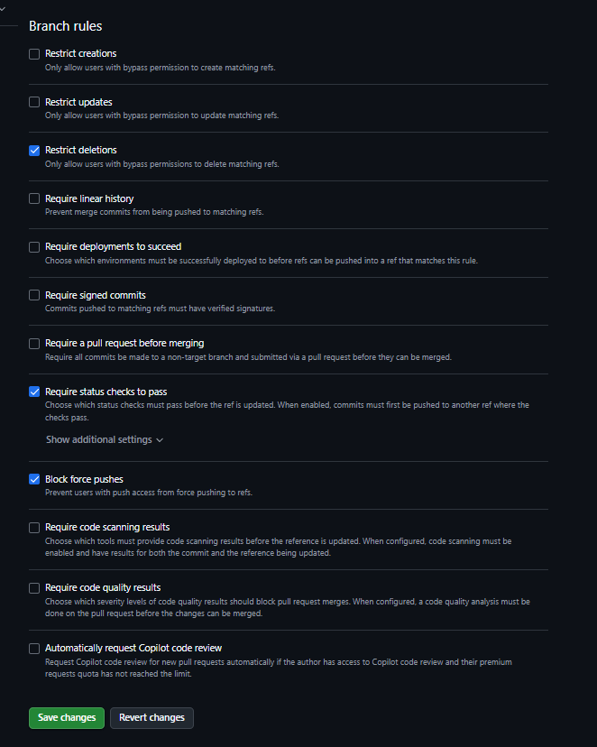

# DS881 — Currículo Profissional

Este repositório contém o desenvolvimento do currículo/portfólio profissional solicitado na atividade prática individual da disciplina DS881.

O projeto foi desenvolvido utilizando React + Vite e publicado no GitHub Pages, aplicando conceitos de:

- Conteinerização com Docker
- Pipeline CI/CD com GitHub Actions
- Governança de código com Pull Requests
- Proteção da branch `main`
- Conventional Commits

---

# 1. Link da Aplicação em Produção

## GitHub Pages

https://andrelleme.github.io/ds881-curriculo-grr20215673/

---

# 2. Execução do Ambiente Local

## Pré-requisitos

- Docker Desktop
- Docker Compose

---

## Executar o projeto

Na raiz do projeto:

```bash
docker compose up --build
```

---

## Acessar aplicação

```text
http://localhost:8080
```

---

# 3. Configuração Docker

## Dockerfile

O projeto utiliza uma imagem baseada em Node Alpine:

```dockerfile
FROM node:22-alpine
```

O Dockerfile prepara o ambiente necessário para execução do projeto React + Vite.

---

## Docker Compose

O Docker Compose foi configurado para:

- Executar o servidor de desenvolvimento do Vite
- Expor a aplicação na porta 8080
- Utilizar bind mounts
- Permitir hot reload

---

## Bind Mounts

A sincronização entre arquivos locais e o contêiner é realizada através da configuração:

```yaml
volumes:
  - .:/app
  - /app/node_modules
```

Essa configuração permite atualização automática da aplicação ao salvar alterações nos arquivos do projeto.

---

# 4. CI/CD com GitHub Actions

O pipeline automatizado está configurado no arquivo:

```text
.github/workflows/main.yml
```

O workflow executa automaticamente:

## Linter / Static Analysis

Verificação de sintaxe e padrões de código utilizando ESLint.

## Build

Validação da compilação da aplicação React/Vite.

## Deploy

Publicação automática no GitHub Pages após merge na branch `main`.

---

# 5. Workflow Git e Governança

## Proteção da Branch Main

A branch `main` foi configurada como protegida utilizando Rulesets do GitHub.

Regras aplicadas:

- Require pull request before merging
- Require status checks to pass
- Block force pushes
- Restrict deletions

---

## Fluxo de Trabalho

Nenhuma alteração é enviada diretamente para a branch `main`.

Fluxo utilizado no projeto:

```text
feature/fix branch
→ Pull Request
→ Pipeline CI/CD verde
→ Merge na main
```

---

## Conventional Commits

Os commits seguem o padrão Conventional Commits.

Exemplos utilizados:

```text
feat: adiciona aplicacao inicial
fix: corrige deploy do github pages
ci: adiciona workflow do github actions
docs: atualiza readme
```

---

# 6. Evidência da Proteção da Branch Main



---

# 7. Autor

André Leme

